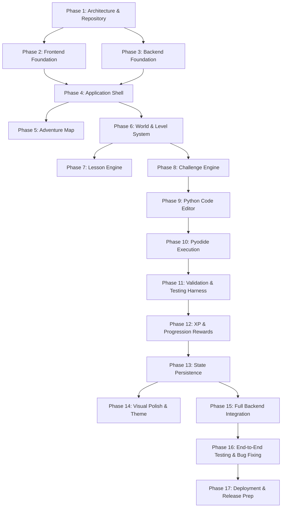

# PyQuest Master Development Plan

**Project:** PyQuest  
**Tagline:** Learn Python. Complete Quests. Master Code.  
**Author:** Lead Software Architect & Engineering Team  
**Status:** In Progress (Phase 1 Complete, Establishing Phase 2-4 Foundations)

---

## 1. Executive Roadmap

PyQuest is developed in 17 systematic, iterative phases. Each phase provides a functional, verifiable milestone with clear deliverables and acceptance criteria.

---

## 2. Phase-by-Phase Breakdown

### Phase 1: Repository Inspection and Architecture (Current)
- [x] Inspect repository state and environment tools (Node v24, Python 3.14).
- [x] Initialize Git version control and establish `.gitignore`.
- [x] Document system architecture (`docs/ARCHITECTURE.md`).
- [x] Formulate master development plan (`docs/DEVELOPMENT_PLAN.md`).
- [x] Create project `README.md` with setup and running instructions.
- [ ] Deliverable: Comprehensive specifications and approved foundational blueprints.

### Phase 2: Frontend Foundation
- [ ] Initialize frontend with React, TypeScript, and Vite.
- [ ] Configure Tailwind CSS / custom design tokens (gaming theme: quest gold, dungeon stone, mana cyan, emerald health, ruby error).
- [ ] Setup modern typography, base CSS reset, and utility styles.
- [ ] Install essential UI icon primitives (Lucide React).
- [ ] Verify clean compilation with `tsc --noEmit` and `npm run build`.

### Phase 3: Backend Foundation
- [ ] Initialize Python backend with FastAPI and Uvicorn.
- [ ] Configure modular project structure (`app/main.py`, `app/api/`, `app/core/`, `app/database/`, `app/models/`, `app/schemas/`).
- [ ] Create database session factory and SQLite connection with SQLAlchemy.
- [ ] Implement health check endpoint (`GET /api/health`).
- [ ] Verify backend startup and test response via HTTP.

### Phase 4: Application Shell & Navigation
- [ ] Build top Quest HUD (Player profile avatar, level badge, XP progress bar, Coin pouch, Audio toggle, Settings).
- [ ] Build main navigation bar (HOME, ADVENTURE, PRACTICE, PROGRESS, PROFILE).
- [ ] Implement responsive view router (SPA state-based screen switcher).
- [ ] Implement responsive viewport layout supporting desktop, laptop, and tablet screens.
- [ ] Implement error boundary and global notification toast system.

### Phase 5: Adventure Map & World Canvas
- [ ] Design interactive map viewport displaying World 1: Python Basics.
- [ ] Implement node path visualizer connecting Level 1, Level 2, and Level 3.
- [ ] Render node state visuals: `LOCKED`, `AVAILABLE`, `IN_PROGRESS`, `COMPLETED`, `MASTERED`.
- [ ] Add player avatar pawn that travels to selected available node.
- [ ] Implement level node click inspection popover (level title, rewards, start quest button).

### Phase 6: World and Level Content System
- [ ] Establish JSON content schema for worlds, levels, lessons, and challenges.
- [ ] Implement World 1 content file: `content/worlds/python-basics.json`.
  - Level 1: "The Spark of Syntax" (What is Python, `print()`, basic syntax).
  - Level 2: "The Alchemy of Variables" (Variables, Strings, Ints, Floats, Booleans).
  - Level 3: "The Scroll of Interaction" (`input()`, type casting, arithmetic expressions).
- [ ] Create content loader service with offline bundling and API sync capabilities.

### Phase 7: Lesson Engine
- [ ] Create interactive lesson reader component.
- [ ] Implement step-by-step theory slide presentation with syntax-highlighted code samples.
- [ ] Add "Try it yourself" interactive code snippets.
- [ ] Support rich callout alerts (Tips, Lore, Quest notes).
- [ ] Add forward/back slide navigation and completion triggers.

### Phase 8: Challenge Engine
- [ ] Build multi-mode challenge presenter supporting:
  - Multiple Choice (Quiz)
  - Predict the Output
  - Fill in the Blank
  - Fix the Bug
  - Write Code
- [ ] Support progressive hint system (reveals hints without spoiling full solution).
- [ ] Provide instant feedback with educational explanations for right and wrong answers.

### Phase 9: Python Code Editor
- [ ] Implement browser-based Python code editor.
- [ ] Features: Syntax highlighting, line numbers, automatic indentation, tab handling, dark adventure theme.
- [ ] Toolbar actions: "Run Code", "Reset to Starter Code", "Submit Quest".
- [ ] Provide output console with tabs for STDOUT, Execution Info, and Test Results.

### Phase 10: Python Execution Engine (Pyodide Client Sandbox)
- [ ] Integrate Pyodide WebAssembly runtime in a dedicated Web Worker.
- [ ] Safe execution environment: isolated from host OS, network, and DOM.
- [ ] Capture `sys.stdout` and `sys.stderr` streams in real time.
- [ ] Execution watchdog with 5-second timeout to safely terminate infinite loops.
- [ ] Handle syntax errors and tracebacks cleanly with user-friendly formatting.

### Phase 11: Validation & Testing Harness
- [ ] Implement test case runner for coding challenges (visible and hidden test cases).
- [ ] Support AST/output checking for flexible logical validation.
- [ ] Validate input/output handling via virtualized standard input.
- [ ] Provide detailed test runner summary cards (passed, failed, expected vs actual).

### Phase 12: XP, Coins, and Progression Engine
- [ ] Award XP (+20 XP normal, +30 XP perfect) and Coins (+5 normal, +10 perfect).
- [ ] Calculate player level thresholds with dynamic level-up triggers.
- [ ] Trigger celebratory Level Clear modal with rewards summary, star rating, and "Next Quest" button.
- [ ] Unlock subsequent level nodes upon successful quest completion.

### Phase 13: State Persistence & Profile Management
- [ ] Store player profile, inventory, and completed level progress in `localStorage`.
- [ ] Provide Profile Screen: stats (Total XP, Quests Completed, Accuracy, Rank), Badges, and reset option.
- [ ] Provide Practice Screen to replay already completed quests.

### Phase 14: Visual Polish & Theme Immersion
- [ ] Enhance pixel-art fantasy aesthetics, ambient glow, and micro-interactions.
- [ ] Implement sound effect manager (synthesized Web Audio for button clicks, level complete fanfare, code success/error chimes) with mute toggle.
- [ ] Smooth transitions between Adventure Map, Lesson, and Code Editor.

### Phase 15: Backend Integration
- [ ] Wire frontend API client to FastAPI backend endpoints.
- [ ] Implement progress synchronization endpoint (`POST /api/progress`).
- [ ] Implement profile load/save endpoint (`GET/POST /api/profile`).
- [ ] Graceful fallback: application remains 100% playable even if backend is offline.

### Phase 16: End-to-End Testing & Bug Fixing
- [ ] Verify full player loop from Landing -> Map -> Lesson -> Quiz -> Editor -> Run -> Submit -> Rewards -> Next Level Unlocked.
- [ ] Test edge cases: syntax errors, infinite loops, malformed input, network loss.
- [ ] Cross-browser validation (Chrome, Firefox, Edge, Safari).

### Phase 17: Deployment Preparation & Documentation
- [ ] Build production frontend assets (`npm run build`).
- [ ] Configure production backend container / start scripts.
- [ ] Finalize documentation, architecture diagrams, and release notes.

---

## 3. Milestones & Verification Checklist

- [x] **Milestone 1:** Architecture & Foundation Plan
- [ ] **Milestone 2:** Functional Frontend & Backend Core Running Concurrently
- [ ] **Milestone 3:** Working Adventure Map with Selectable Level Nodes
- [ ] **Milestone 4:** Complete Lesson & Quiz System
- [ ] **Milestone 5:** Live In-Browser Python Editor & Pyodide Execution
- [ ] **Milestone 6:** Playable 3-Level Vertical Slice (End-to-End PyQuest Experience)
- [ ] **Milestone 7:** Final Polish & Integrated Backend Persistence
